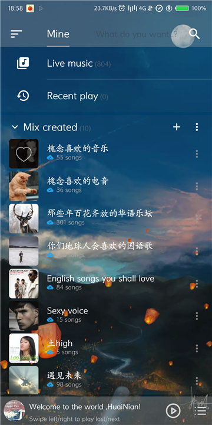
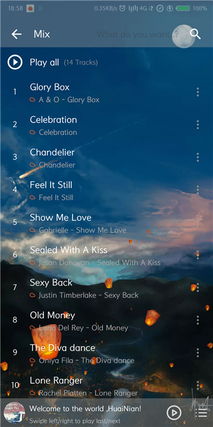
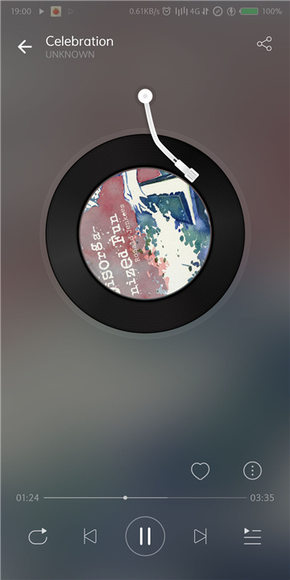
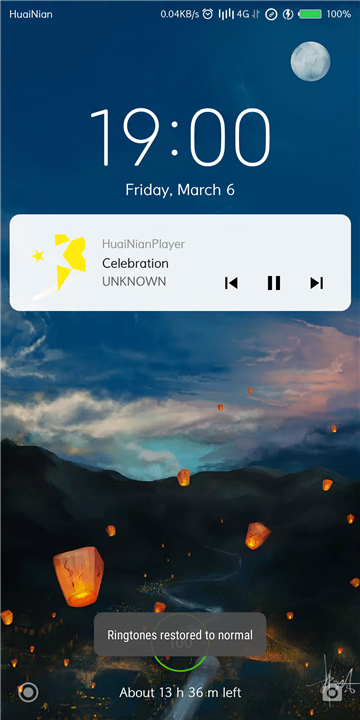

## HuaiNianPlayer

一个使用React-Native构建的Android在线音乐播放器。

## 功能

提供了常见的在线播放器的基本功能

+ 支持乱序播放、单曲循环、列表循环。
+ 支持通知栏和锁屏界面对播放器的控制
+ 支持查看历史记录
+ 支持专辑的删改

## 界面

## 局限

+ 由于为局域网服务器，暂不支持外网使用
+ 暂不支持下载&本地播放
+ 没有收录各Track的cover
+ ....